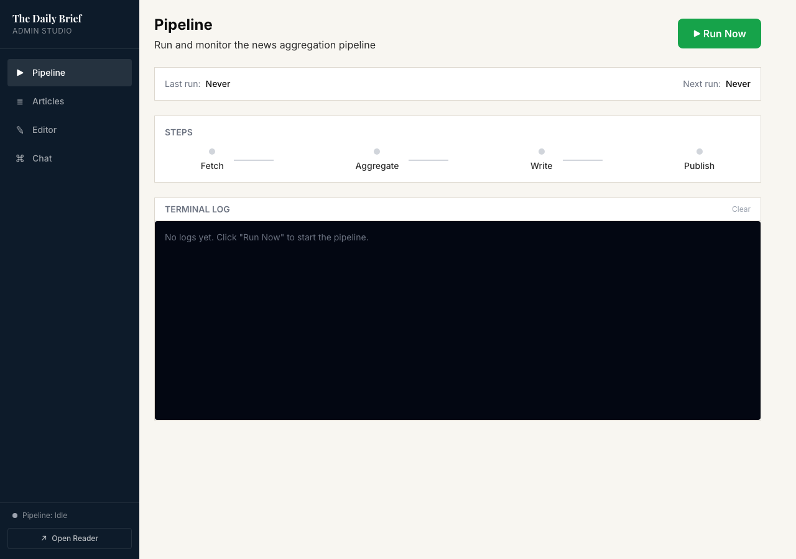

# The Daily Brief

An automated financial news aggregator that fetches headlines, deduplicates and ranks them with an LLM, then generates a structured market intelligence article — complete with hero images and stock picks for retail investors.

---

## Screenshots

### News feed — featured article and sidebar


### Article view — light mode


### Article view — dark mode


### Article body — What's Happening and Market Breakdown


### Article body — Market Breakdown sub-headings


### Article body — Opportunities, Risks and The Bigger Picture


### Admin Studio — Articles list


### Admin Studio — CMS Editor


### Admin Studio — Pipeline runner


---

## How It Works

1. **Fetch** — pulls headlines from NewsAPI, Finnhub, and Alpha Vantage
2. **Aggregate** — Minimax LLM deduplicates and ranks stories by significance
3. **Write** — LLM generates a full article: executive summary, market breakdown (with `###` sub-headings), opportunities with tickers, risks, and macro outlook
4. **Publish** — article saved as JSON to the CMS; hero image fetched from Pexels (Unsplash static fallback per category)

---

## Stack

| Layer | Tech |
|---|---|
| Frontend | React 18, Vite, Tailwind CSS, Playfair Display + Lora fonts |
| Backend | Express.js (port 3000) |
| Pipeline | Node.js CLI (`node pipeline/index.js`) |
| LLM | Minimax `MiniMax-M2.7` (OpenAI-compatible API) |
| Images | Pexels API (Unsplash static fallback) |
| News sources | NewsAPI, Finnhub, Alpha Vantage |

---

## Getting Started

### 1. Install dependencies

```bash
npm install
cd frontend && npm install
```

### 2. Configure environment

Create a `.env` file at the project root:

```
NEWSAPI_KEY=
FINNHUB_KEY=
ALPHA_VANTAGE_KEY=
MINIMAX_API_KEY=
PEXELS_API_KEY=
```

### 3. Run

```bash
# Terminal 1 — backend
node backend/server.js

# Terminal 2 — frontend dev server
cd frontend && npm run dev
```

Open `http://localhost:5175/reader`.

### 4. Generate an article

```bash
node pipeline/index.js
```

Or use the Admin Studio at `http://localhost:5175/admin`.

---

## Project Structure

```
pipeline/
  index.js        # Orchestrator — fetch → rank → write → save
  fetcher.js      # NewsAPI, Finnhub, Alpha Vantage clients
  llm.js          # Minimax calls (aggregate + write column)
  formatter.js    # Markdown → CMS block array
  images.js       # Pexels / Unsplash hero image fetcher
  config.js       # Environment config

backend/
  server.js
  routes/
    articles.js   # CRUD for articles + excerpt computation
    pipeline.js   # Trigger pipeline via HTTP
    chat.js       # Minimax chat proxy
    assets.js     # Image upload

frontend/
  src/
    reader/       # Public feed (NewsFeed, ArticleView, ReaderLayout)
    admin/        # Admin Studio (pipeline runner, CMS editor)

content/
  articles/       # Published articles as JSON
  published/      # Exported markdown files
```

---

## API Endpoints

| Method | Path | Description |
|---|---|---|
| `GET` | `/api/articles` | List articles (includes pre-computed excerpt) |
| `GET` | `/api/articles/:id` | Full article with blocks |
| `POST` | `/api/articles` | Create article |
| `PUT` | `/api/articles/:id` | Update article |
| `DELETE` | `/api/articles/:id` | Delete article |
| `POST` | `/api/pipeline/run` | Trigger pipeline |
| `POST` | `/api/chat` | Streaming chat (Minimax) |
